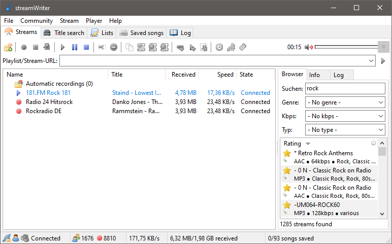

# streamWriter

A windows application for recording/playing internet-radio streams.

Visit [streamwriter.org](https://streamwriter.org) for more information.

  

### Features
- Record as many streams as you want at the same time (MP3/AAC)
- Automatically record a wishlist's song when it's playing on a stream
- Player for streams and recorded files
- Track splitting with silence detection
- Function for manual cutting of saved titles
- Tracks are named by a given pattern
- Short songs (ads) can be skipped
- Writing of tags to recorded files
- Script-based postprocessing
- Applying of effects to recorded songs (SoX)
- Integration of different audio encoders
- Scheduled recordings
- Stream browser
- Multilingual
- Can be installed or used in portable mode
- Built using Lazarus :fire:

### Installation
Downloads are available at [streamwriter.org](https://streamwriter.org/en/downloads).

### Building
- Install Lazarus IDE and the tools to crosscompile
- Install MSYS2 with mingw32 (required for building Mbed TLS)

Edit "Scripts\SetEnvironment.bat" to set some required paths. Afterwards run "Scripts\Build.bat" to build a release build.
